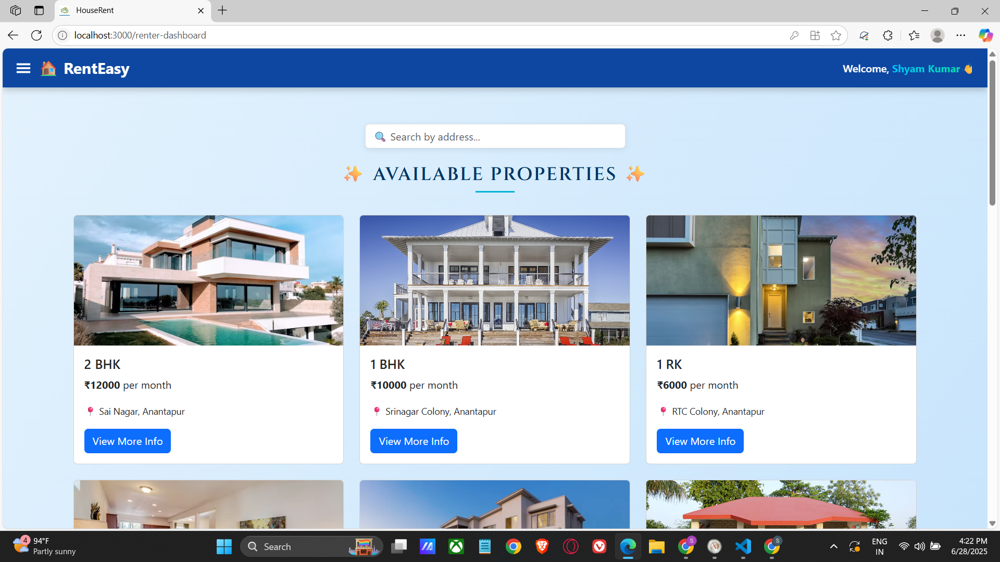
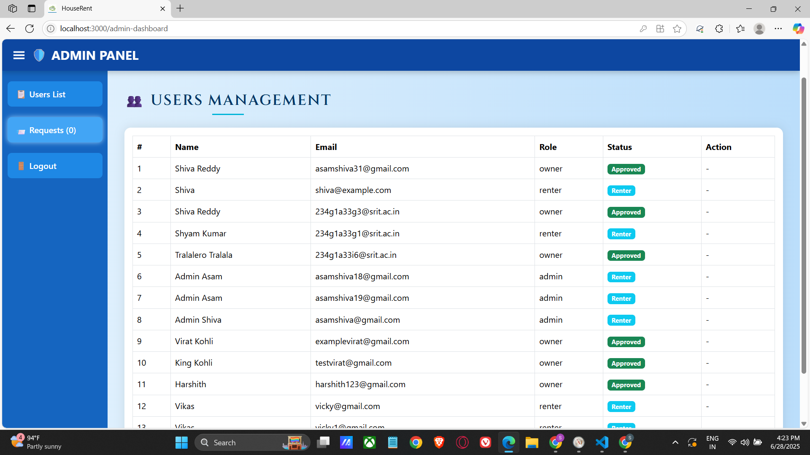

# 🏠 RentEasy — Finding Your Perfect Rental Home

A MERN stack house rental web application where renters can browse and book rental properties, and owners can list and manage their properties.


## 🚀 Features

### 👤 User Roles:
- **Renter**: Register, login, search properties, view details, book, and track booking status.
- **Owner**: Register (admin approval required), login, add/update/delete property listings, approve or reject bookings.
- **Admin**: Manage users, approve owners, maintain platform rules.

## 📷 Screenshots

### 🔐 Login Page


### 📝 Renter Dashboard


### 🏘️ Owner Dashboard


### ➕ Add Property Page


### ⚙️ Admin Dashboard



## 🎬 Demo Video

Watch full walkthrough here:  
📺 🎥 [Watch Project Demo on Google Drive](https://drive.google.com/file/d/1RsTuKI9M3080rFRvhUONWe28hnMm8h-Y/view?usp=sharing)


## 🛠️ Tech Stack

- **Frontend**: React.js, Bootstrap, Material UI, Axios
- **Backend**: Node.js, Express.js
- **Database**: MongoDB, Mongoose
- **Authentication**: JWT
- **File Uploads**: Multer
- **Other**: Moment.js, Ant Design, React-Router


## 📁 Project Structure

<pre> ``` HouseRent/ ├── backend/ │ ├── models/ │ ├── routes/ │ └── server.js ├── frontend/ │ ├── public/ │ ├── src/ │ ├── pages/ │ ├── components/ │ └── App.js, index.js ├── screenshots/ │ └── *.png (all demo screenshots) ├── .env └── README.md ``` </pre>


## 🧑‍💻 Developed By

   *Shiva Reddy and Team*

    🎥 **Watch Demo on [Google Drive](https://drive.google.com/file/d/1RsTuKI9M3080rFRvhUONWe28hnMm8h-Y/view?usp=sharing)**


## 📌 Notes

- Owner accounts need admin approval.
- Protected routes implemented via JWT middleware.
- Responsive UI across devices.