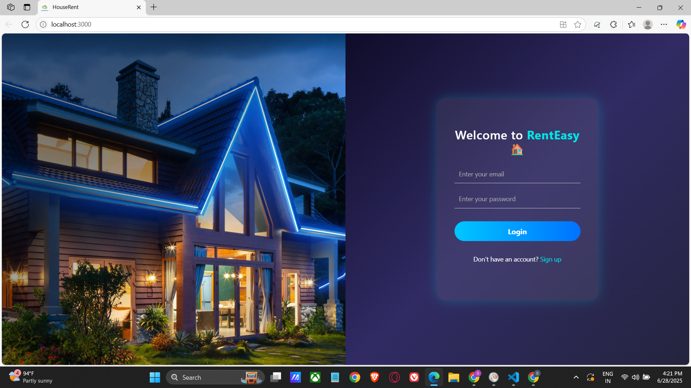
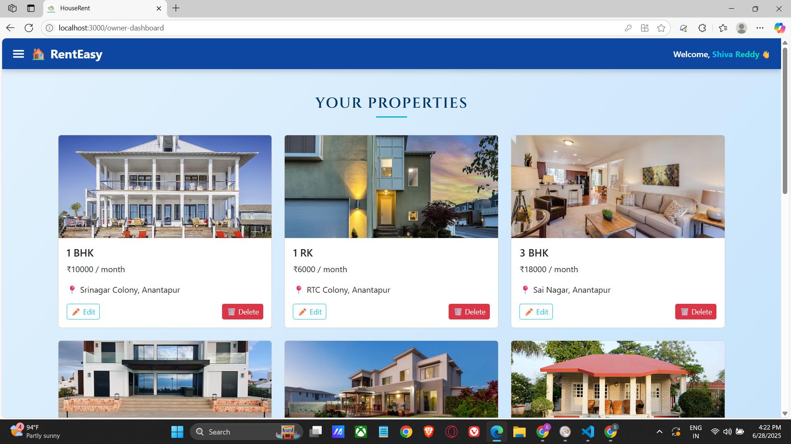
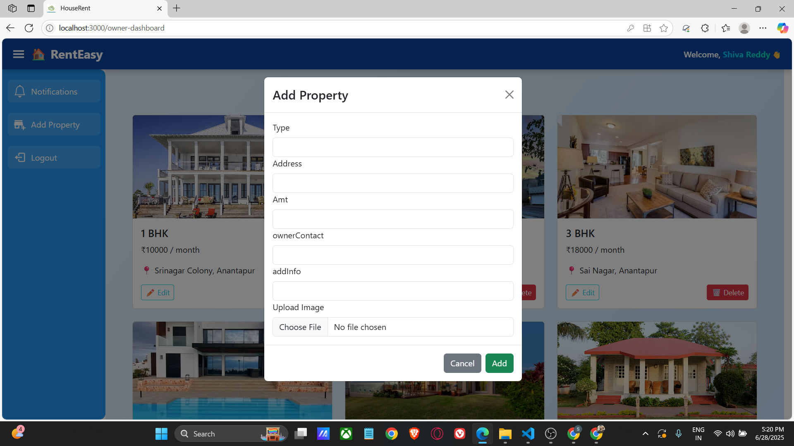

# 🏠 RentEasy — Finding Your Perfect Rental Home

A MERN stack house rental web application where renters can browse and book rental properties, and owners can list and manage their properties.

## 🚀 Features

### 👤 User Roles:
- **Renter**: Register, login, search properties, view details, book, and track booking status.
- **Owner**: Register (admin approval required), login, add/update/delete property listings, approve or reject bookings.
- **Admin**: Manage users, approve owners, maintain platform rules.

## 📷 Screenshots

### 🔐 Login Page

### 📝 Renter Dashboard

### 🏘️ Owner Dashboard

### ➕ Add Property Page

### ⚙️ Admin Dashboard

## 🎬 Demo Video

Watch full walkthrough here:  
📺 [YouTube Demo Video](https://youtu.be/eRY9exoa4DE)

## 🛠️ Tech Stack

- **Frontend**: React.js, Bootstrap, Material UI, Axios
- **Backend**: Node.js, Express.js
- **Database**: MongoDB, Mongoose
- **Authentication**: JWT
- **File Uploads**: Multer
- **Other**: Moment.js, Ant Design, React-Router

## 📁 Project Structure

HouseRent/
│
├── backend/
│ ├── models/
│ ├── routes/
│ └── server.js
│
├── frontend/
│ ├── public/
│ ├── src/
│ ├── pages/
│ ├── components/
│ └── App.js, index.js
│
├── screenshots/
│ └── *.png (all demo screenshots)
│
├── .env
└── README.md

## 🧑‍💻 Developed By

   *Shiva Reddy and Team*
   📺 [YouTube Demo Video](https://youtu.be/eRY9exoa4DE)

## 📌 Notes

- Owner accounts need admin approval.
- Protected routes implemented via JWT middleware.
- Responsive UI across devices.